# SOPP AI — Arquitectura del Sistema
### Documento de Arquitectura · Estilo C4 · Nivel Contexto → Componentes

> **Versión:** 1.0  
> **Estado:** Definición formal  
> **Alcance:** Contexto, contenedores y componentes. No llega a nivel de código.

---

## Tabla de Contenidos

1. [Nivel 1 — Contexto del Sistema](#1-nivel-1--contexto-del-sistema)
2. [Nivel 2 — Contenedores](#2-nivel-2--contenedores)
3. [Nivel 3 — Componentes del CLI](#3-nivel-3--componentes-del-cli)
4. [Nivel 3 — Componentes del Hub](#4-nivel-3--componentes-del-hub)
5. [Experiencia del Usuario — CLI](#5-experiencia-del-usuario--cli)
6. [Repositorios de Contenido](#6-repositorios-de-contenido)
7. [Flujos de Interacción](#7-flujos-de-interacción)
8. [Estructuras de Datos Clave](#8-estructuras-de-datos-clave)
9. [Gobierno y Roles](#9-gobierno-y-roles)
10. [Decisiones de Diseño Abiertas]
11. [Infraestructura AWS](#10-decisiones-de-diseño-abiertas)

---

## 1. Nivel 1 — Contexto del Sistema

El sistema SOPP AI estandariza el acceso a skills, agents, workflows, steering y conocimiento de IA para todos los pragmáticos de Pragma, sin importar el IDE que usen, la cuenta en la que trabajen o el stack tecnológico del proyecto. Elimina la configuración manual, los desface de versiones y la dispersión de conocimiento entre equipos.

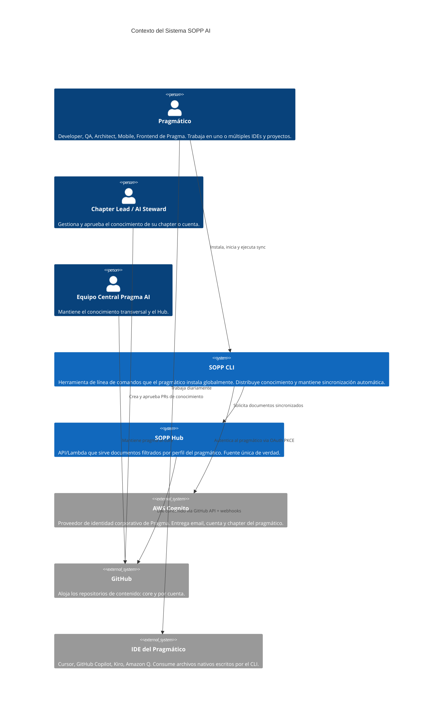

---

## 2. Nivel 2 — Contenedores


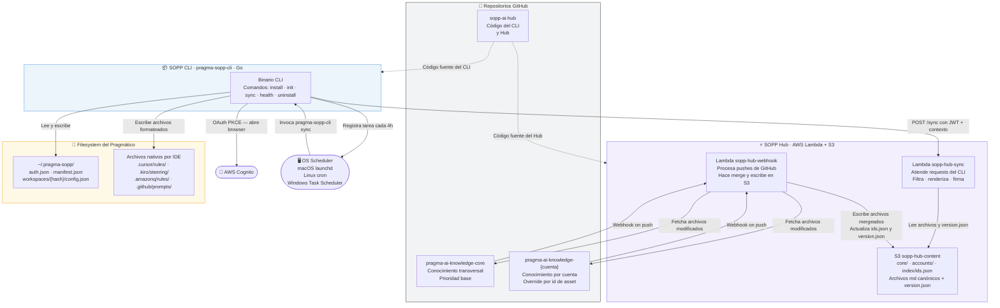

---

## 3. Nivel 3 — Componentes del CLI

El CLI es el único canal de distribución de conocimiento. Es un binario Go distribuido via GitHub Releases. Se instala globalmente una sola vez y expone los comandos `install`, `init`, `sync`, `health` y `uninstall`.

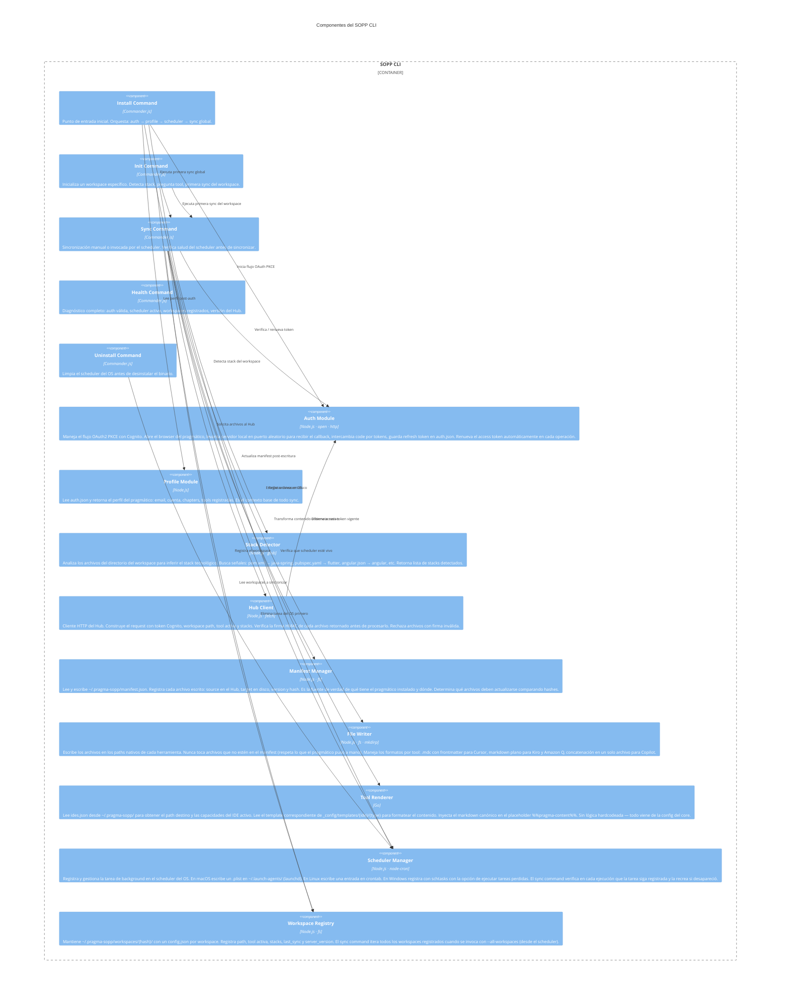

### 3.1 Comandos del CLI

| Comando | Descripción | Cuándo se usa |
|---|---|---|
| `pragma-sopp-cli install` | Setup inicial completo: auth, perfil, scheduler, sync global de archivos obligatorios | Una sola vez al incorporarse a Pragma |
| `pragma-sopp-cli init` | Inicializa un workspace: detecta stack, registra tool, primera sync del proyecto | Cada vez que el pragmático arranca un proyecto nuevo |
| `pragma-sopp-cli sync` | Sincroniza todos los workspaces registrados con el Hub | Manualmente o cada 4h via scheduler del OS |
| `pragma-sopp-cli sync --workspace .` | Sincroniza solo el workspace actual | Cuando el pragmático quiere forzar actualización de un proyecto |
| `pragma-sopp-cli health` | Diagnóstico: auth, scheduler, workspaces, conectividad con Hub | Cuando algo no funciona como se espera |
| `pragma-sopp-cli uninstall` | Limpia scheduler + archivos de config antes de desinstalar | Al desinstalar el CLI |

### 3.2 Archivos globales obligatorios

Estos archivos se instalan en la máquina del pragmático durante `pragma-sopp-cli install` y se verifican en cada sync. Si no existen se recrean automáticamente. Son `required: true` en el manifest.

| Archivo | Propósito | Destino por herramienta |
|---|---|---|
| Steering global de Pragma | Instrucciones base para el AI en todos los proyectos | `~/.cursor/rules/pragma-global.mdc` · `~/.kiro/steering/pragma-global.md` · `~/.aws/amazonq/rules/pragma-global.md` |
| Guardrails globales de Pragma | Restricciones que el AI nunca debe violar | Mismo patrón que steering global |

### 3.3 Flujo de re-autenticación

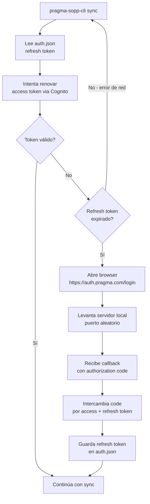

---

## 4. Nivel 3 — Componentes del Hub

El Hub son dos Lambdas con responsabilidades completamente separadas y S3 como contrato entre ellas. Una Lambda nunca sabe lo que hace la otra.

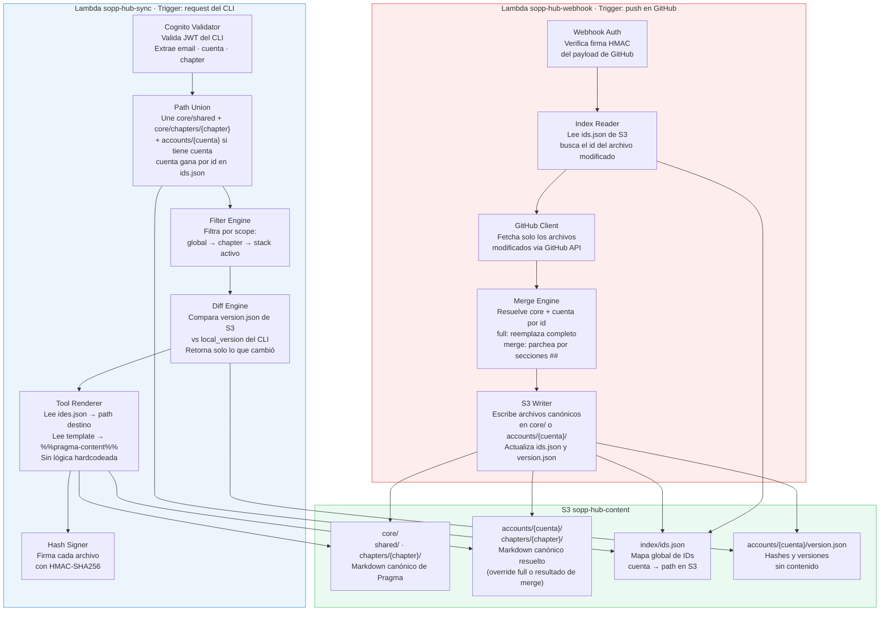

### 4.1 Estructura de S3

```
s3://sopp-hub-content/
  index/
    ids.json                    ← índice global de todos los IDs y sus paths

  core/
    shared/
      steering/
      guardrails/
    chapters/
      backend/
        steering/
        skills/java-spring/
        skills/node/
        workflows/
        guardrails/
        personas/
      calidad/
      mobile/flutter/
      mobile/android/
      frontend/react/
      frontend/angular/
      arquitectura/

  accounts/
    {cuenta}/
      version.json              ← hashes y versiones, sin contenido
      chapters/
        {chapter}/
          skills/{stack}/
            {id}.md             ← override full o resultado de merge
```

### 4.2 Override por id — los tres casos

| Caso | Qué hace el webhook | Qué queda en S3 |
|---|---|---|
| Push a core, sin overrides en cuentas | Escribe en `core/` | Archivo de core actualizado |
| Push a cuenta, `pragma_override: full` | Escribe el archivo de cuenta tal cual | `accounts/{cuenta}/.../{id}.md` con contenido de cuenta |
| Push a cuenta, `pragma_override: merge` | Fetcha core, mergea sección por sección (`##`), escribe resultado | `accounts/{cuenta}/.../{id}.md` con contenido combinado — cuenta gana en conflictos |

### 4.3 Lambda sync — lógica de unión por perfil

```
perfil: { cuenta: bancolombia, chapter: backend, stacks: [java-spring] }

Fuentes consultadas en S3:
  core/shared/                            → siempre (steering global, guardrails)
  core/chapters/backend/                  → chapter del pragmático
  accounts/bancolombia/chapters/backend/  → overrides y exclusivos de cuenta

Unión por id (ids.json):
  id tiene path en accounts/bancolombia → usa accounts/bancolombia
  id solo tiene path en core            → usa core

Filtro por scope:
  scope=global  → siempre incluido
  scope=chapter → si chapter == "backend"
  scope=stack   → si "java-spring" ∈ stacks del pragmático

Sin cuenta asignada → solo core/shared/ + core/chapters/{chapter}/
```

---

## 5. Experiencia del Usuario — CLI

Esta sección describe exactamente qué ve y hace el pragmático en cada interacción con el CLI, desde la instalación inicial hasta el uso diario. Es la referencia para diseñar los textos, flujos y mensajes del binario.

---

### 5.1 pragma-sopp-cli install — primera vez

Se ejecuta una sola vez cuando el pragmático se incorpora a SOPP AI.

```
$ pragma-sopp-cli install

╔══════════════════════════════════════════╗
║      Solving with AI — SOPP              ║
║           pragma-sopp-cli 🧠             ║
╚══════════════════════════════════════════╝

Abriendo browser para autenticación con tu cuenta de Pragma...
(Si el browser no se abre, visita: https://auth.pragma.com.co/login?code=XXXX)

✓ Autenticado correctamente
  Usuario:  david@pragma.com.co
  Cuenta:   bancolombia
  Chapter:  backend

¿Qué herramientas usas? Selecciona con comas (ej: 1,3)
  1. Cursor
  2. GitHub Copilot (VS Code)
  3. Kiro
  4. Amazon Q (IDE)
  5. Amazon Q (CLI)
> 1,4

Descargando conocimiento de Pragma para tu perfil...

  ✓ Steering global de Pragma     → ~/.cursor/rules/pragma-global.mdc
  ✓ Steering global de Pragma     → ~/.aws/amazonq/rules/pragma-global.md
  ✓ MCP Server de métricas        → ~/.cursor/mcp.json
  ✓ MCP Server de métricas        → ~/.aws/amazonq/mcp.json
  ✓ MCP Server de métricas        → ~/.vscode/mcp.json
  ✓ Guardrails globales           → ~/.cursor/rules/pragma-guardrails.mdc
  ✓ Guardrails globales           → ~/.aws/amazonq/rules/pragma-guardrails.md

Registrando sincronización automática...
  ✓ Tarea programada cada 4 horas (launchd)

══════════════════════════════════════════════
✓ Instalación completa · 7 archivos instalados

Próximo paso: ve a cada proyecto en el que trabajas y ejecuta:
  pragma-sopp-cli init
══════════════════════════════════════════════
```

---

### 5.2 pragma-sopp-cli init — inicializar un proyecto

Se ejecuta dentro del directorio de cada proyecto. El pragmático lo corre una vez por workspace.

```
$ cd /projects/savings-account
$ pragma-sopp-cli init

Analizando proyecto en /projects/savings-account...
  ✓ Stack detectado: java-spring  (encontré pom.xml)

¿Con qué herramienta trabajas en este proyecto?
  1. Cursor
  2. GitHub Copilot (VS Code)
  3. Kiro
  4. Amazon Q (IDE)
  5. Amazon Q (CLI)
> 1

¿Hay algún stack adicional en este proyecto? [s/N]
> N

Descargando conocimiento de backend / java-spring...

  ✓ Steering de chapter backend        → .cursor/rules/pragma-backend.mdc
  ✓ Skill: webflux-error-handling      → .cursor/rules/skills/webflux-error-handling.mdc
  ✓ Skill: generate-pr-description     → .cursor/rules/skills/generate-pr-description.mdc
  ✓ Skill: clean-architecture-review   → .cursor/rules/skills/clean-architecture-review.mdc
  ✓ Skill: spring-security-patterns    → .cursor/rules/skills/spring-security-patterns.mdc
  ✓ Workflow: feature-development      → .cursor/rules/workflows/feature-development.mdc
  ✓ Workflow: code-review-checklist    → .cursor/rules/workflows/code-review-checklist.mdc
  ✓ Guardrails de chapter backend      → .cursor/rules/pragma-backend-guardrails.mdc
  ✓ Persona: senior-backend-reviewer   → .cursor/rules/personas/senior-backend-reviewer.mdc
  + 4 archivos más...

══════════════════════════════════════════════
✓ Proyecto listo · 13 archivos instalados
  Cursor ya tiene el conocimiento de backend / java-spring

Tip: si cambias de herramienta en este proyecto,
corre pragma-sopp-cli init de nuevo.
══════════════════════════════════════════════
```

**Escenario: stack adicional en el mismo proyecto (monorepo)**

```
¿Hay algún stack adicional en este proyecto? [s/N]
> s

¿Cuál stack adicional?
  1. node-nest     4. react
  2. node-express  5. angular
  3. dotnet        6. flutter
> 1

  ✓ Skill: nestjs-module-structure  → .cursor/rules/skills/nestjs-module-structure.mdc
  ✓ Skill: nestjs-interceptors      → .cursor/rules/skills/nestjs-interceptors.mdc
  + 2 archivos más para node-nest...
```

---

### 5.3 pragma-sopp-cli sync — sincronización manual

El pragmático puede forzar una sincronización en cualquier momento.

```
$ pragma-sopp-cli sync

Sincronizando workspaces...

  /projects/savings-account  (cursor · java-spring)
    ↑ webflux-error-handling         1.2.0 → 1.3.0
    · generate-pr-description        sin cambios
    + spring-observability-patterns  nuevo

  /projects/api-gateway  (amazon-q-ide · node-nest)
    · Sin cambios

  /projects/infra-scripts  (cursor · java-spring)
    ↑ webflux-error-handling         1.2.0 → 1.3.0

══════════════════════════════════════════════
✓ Sync completo · 2 actualizados · 1 nuevo · versión 2.4.0
══════════════════════════════════════════════
```

**Escenario: sin cambios**

```
$ pragma-sopp-cli sync

  ✓ Todo al día · versión 2.4.0 · último sync hace 2h
```

**Escenario: sesión expirada (detectada al correr cualquier comando)**

```
$ pragma-sopp-cli sync

⚠  Tu sesión expiró. El sync automático está pausado.

Abriendo browser para re-autenticarte...
✓ Sesión renovada

Retomando sync...
  ✓ 3 workspaces sincronizados · versión 2.4.0
```

---

### 5.4 pragma-sopp-cli health — diagnóstico

```
$ pragma-sopp-cli health

SOPP AI · Diagnóstico
══════════════════════════════════════════════

Autenticación
  ✓ david@pragma.com.co · bancolombia · backend
  ✓ Sesión vigente (expira en 6 días)

Scheduler
  ✓ Activo · cada 4 horas (launchd)
  ✓ Último run: hace 1h 42min · Próximo: en 2h 18min

Herramientas
  ✓ Cursor   ✓ Amazon Q (IDE)

Workspaces (3)
  ✓ /projects/savings-account    cursor · java-spring   · sync hace 1h · v2.4.0
  ✓ /projects/api-gateway        amazon-q-ide · node-nest · sync hace 1h · v2.4.0
  ⚠ /projects/infra-scripts      cursor · java-spring   · sync hace 6h · v2.3.1

Archivos instalados
  ✓ 3 globales obligatorios presentes
  ✓ 44 de workspaces

Hub
  ✓ https://hub.sopp.pragma.com.co · 118ms · v2.4.0

══════════════════════════════════════════════
Estado: ✓ OK  (1 advertencia)

Para actualizar el workspace desactualizado:
  cd /projects/infra-scripts && pragma-sopp-cli sync --workspace .
══════════════════════════════════════════════
```

**Escenario: scheduler muerto — se autorecrea**

```
Scheduler
  ✗ No encontrado en launchd
  ↺ Recreando tarea automáticamente...
  ✓ Tarea registrada (cada 4 horas)
```

---

### 5.5 pragma-sopp-cli uninstall

```
$ pragma-sopp-cli uninstall

¿Seguro? Esto eliminará:
  · La tarea de sync automático del scheduler
  · ~/.pragma-sopp/  (auth, manifest, workspaces)
  · Los archivos globales instalados en tus IDEs

Los archivos de workspace (.cursor/rules/, .amazonq/rules/, etc.)
NO se tocan. Puedes borrarlos manualmente si lo deseas.

¿Continuar? [s/N]
> s

  ✓ Scheduler eliminado (launchd)
  ✓ ~/.pragma-sopp/ eliminado
  ✓ Archivos globales eliminados de Cursor y Amazon Q

Hasta pronto 👋
```

---

### 5.6 Experiencia en el IDE tras la instalación

Una vez que el CLI instaló los archivos, el pragmático no interactúa con SOPP AI directamente. Todo ocurre de forma transparente en el IDE gracias al steering instalado.

**Al abrir una conversación — si hay actualizaciones pendientes desde el último sync:**

```
Usuario:  Hola, necesito ayuda con este endpoint de pagos

  AI: Antes de empezar: hay 2 skills nuevos desde tu último sync
      · spring-observability-patterns
      · async-error-handling-patterns
      Los tengo disponibles para esta sesión.

      Claro, con gusto te ayudo. ¿Me compartes el código del endpoint?
```

Si no hay nada nuevo, el AI simplemente responde sin mencionar SOPP AI. El pragmático nunca ve menciones al Hub ni al sistema — solo el AI comportándose con el contexto correcto de Pragma ya cargado.

---

## 6. Repositorios de Contenido

### 6.1 Los tres repositorios

| Repo | Dueño | Propósito | Cadencia de cambio |
|---|---|---|---|
| `pragma-ai-knowledge-core` | Equipo Central Pragma AI | Conocimiento transversal a toda la empresa | Sprints de 2 semanas |
| `pragma-ai-knowledge-{cuenta}` | AI Steward de la cuenta | Sobreescrituras y adiciones específicas por cuenta | Continua según necesidades de la cuenta |
| `sopp-ai-hub` | Equipo de Plataforma | Código del Hub, MCP server y CLI | Bajo acoplamiento, versiones semánticas |

### 6.2 Estructura de carpetas (idéntica en core y en cuenta)

```
/
├── chapters/
│   ├── backend/
│   │   ├── skills/
│   │   │   ├── java-spring/       ← scope: stack
│   │   │   ├── node/              ← scope: stack
│   │   │   └── dotnet/            ← scope: stack
│   │   ├── agents/
│   │   ├── workflows/
│   │   ├── steering/
│   │   ├── guardrails/
│   │   ├── prompts/
│   │   ├── personas/
│   │   └── convenciones/
│   ├── calidad/
│   │   └── ... (misma estructura)
│   ├── mobile/
│   │   ├── flutter/
│   │   └── android/
│   ├── frontend/
│   │   ├── react/
│   │   └── angular/
│   └── arquitectura/
└── shared/
    ├── docs/
    ├── adrs/
    ├── guardrails/
    ├── steering/
    └── mcp/
        └── mcp-config.json        ← config del MCP server para todos los IDEs
```

### 6.3 Frontmatter canónico de un asset

```yaml
---
id: generate-pr-description
version: 1.2.0
scope: stack              # global | chapter | stack
chapter: backend          # requerido si scope != global
stack: [java-spring]      # vacío = aplica a todo el chapter
tags: [pr, git, review]
pragma_extends: null      # path del asset que extiende (override parcial)
pragma_override: full     # full | merge
---

# Contenido del asset en markdown...
```

### 6.4 Regla de override

Mismo path relativo en `pragma-ai-knowledge-{cuenta}` sobrescribe `pragma-ai-knowledge-core`. Sin configuración adicional.

```
pragma-ai-knowledge-core:    chapters/backend/skills/java-spring/generate-pr-description.md  ← base
sopp-ai-cuenta:  chapters/backend/skills/java-spring/generate-pr-description.md  ← gana siempre
```

---

## 7. Flujos de Interacción

### 7.1 Instalación inicial (pragma-sopp-cli install)

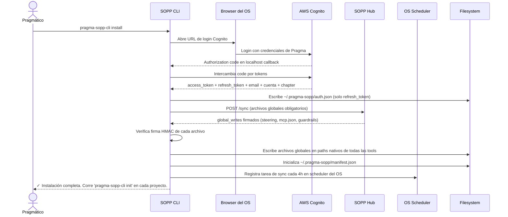

### 7.2 Inicialización de workspace (pragma-sopp-cli init)

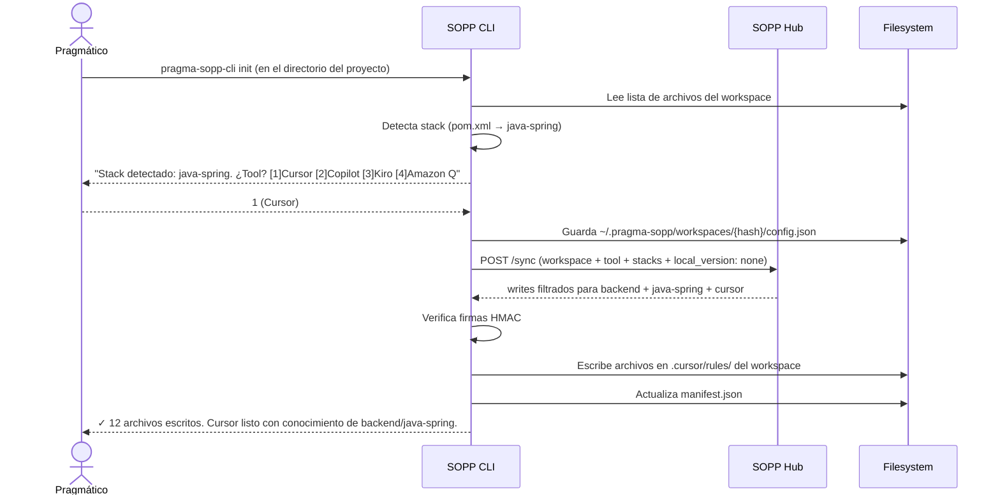

### 7.3 Sync automático (background task cada 4h)

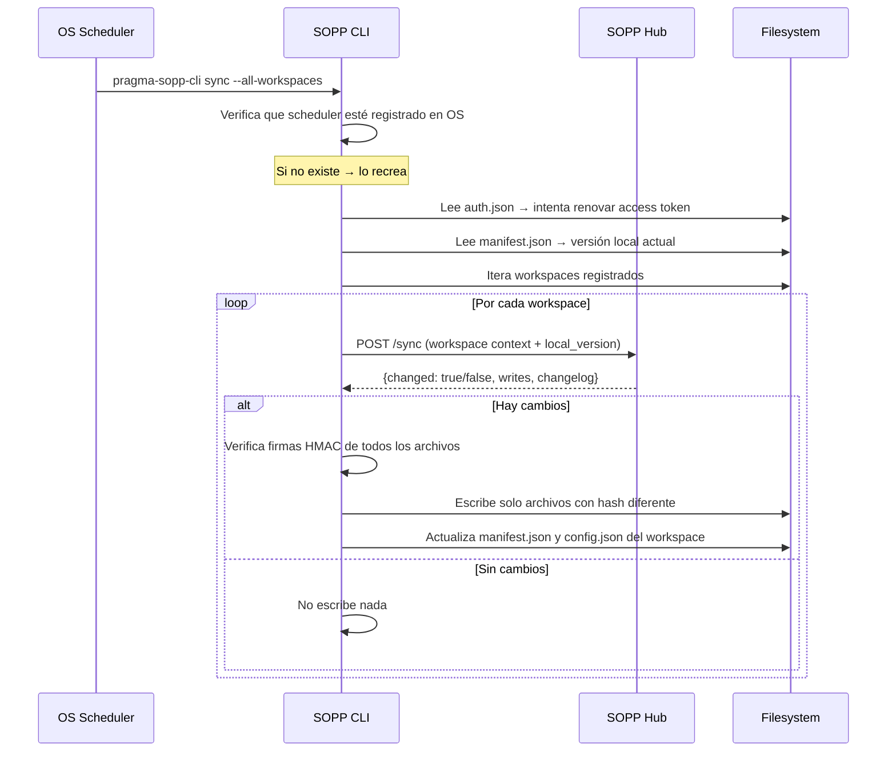

### 7.4 Invalidación de cache por push en GitHub

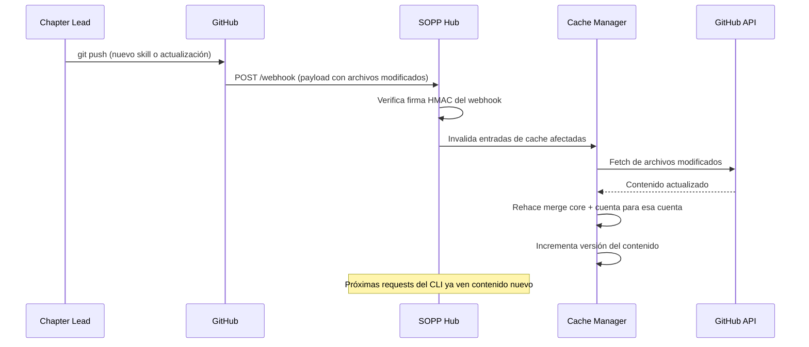

### 7.5 Registro de HU desde el IDE

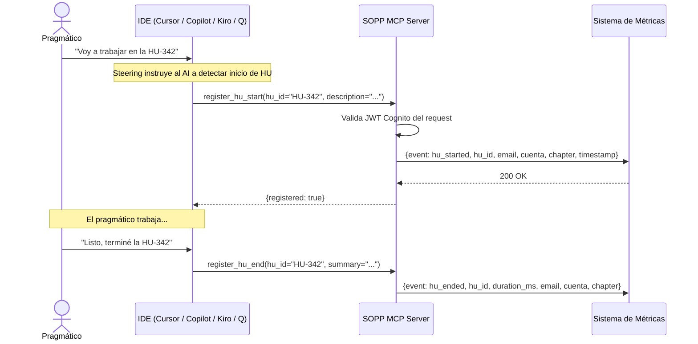

---

## 8. Estructuras de Datos Clave

### 8.1 ~/.pragma-sopp/auth.json

```json
{
  "email": "david@pragma.com.co",
  "cuenta": "bancolombia",
  "chapter": "backend",
  "refresh_token": "eyJjdHkiOiJKV1QiLCJlb...",
  "installed_at": "2026-04-28T10:00:00Z",
  "tools": ["cursor", "amazon-q-ide"]
}
```

### 8.2 ~/.pragma-sopp/manifest.json

```json
{
  "global": [
    {
      "source": "shared/steering/pragma-global.md",
      "targets": {
        "cursor": "~/.cursor/rules/pragma-global.mdc",
        "amazon-q-ide": "~/.aws/amazonq/rules/pragma-global.md"
      },
      "version": "1.0.2",
      "hash": "sha256:e3b0c44298fc",
      "required": true,
      "last_written": "2026-04-28T10:30:00Z"
    },
    {
      "source": "shared/mcp/mcp-config.json",
      "targets": {
        "cursor": "~/.cursor/mcp.json",
        "amazon-q-ide": "~/.aws/amazonq/mcp.json"
      },
      "version": "1.0.0",
      "hash": "sha256:a1b2c3d4e5f6",
      "required": true,
      "last_written": "2026-04-28T10:30:00Z"
    }
  ],
  "workspaces": {
    "a3f9bc12": {
      "path": "/Users/david/projects/savings-account",
      "tool": "cursor",
      "stacks": ["java-spring"],
      "server_version": "2.4.0",
      "last_sync": "2026-04-28T10:30:00Z",
      "files": [
        {
          "source": "chapters/backend/skills/java-spring/webflux-error-handling.md",
          "target": ".cursor/rules/skills/webflux-error-handling.mdc",
          "version": "1.3.0",
          "hash": "sha256:f4e3d2c1b0a9",
          "last_written": "2026-04-28T10:30:00Z"
        }
      ]
    }
  }
}
```

### 8.3 ~/.pragma-sopp/workspaces/{hash}/config.json

```json
{
  "path": "/Users/david/projects/savings-account",
  "tool": "cursor",
  "stacks": ["java-spring"],
  "chapter": "backend",
  "cuenta": "bancolombia",
  "server_version": "2.4.0",
  "last_sync": "2026-04-28T10:30:00Z"
}
```

### 8.4 Detección de stack por archivos del workspace

| Archivo detectado | Stack inferido |
|---|---|
| `pom.xml`, `build.gradle` (sin AndroidManifest) | `java-spring` |
| `package.json` + `nest-cli.json` | `node-nest` |
| `package.json` (sin nest, sin angular, sin vite/next) | `node-express` |
| `*.csproj`, `*.sln` | `dotnet` |
| `pubspec.yaml` | `flutter` |
| `build.gradle` + `AndroidManifest.xml` | `android-kotlin` |
| `package.json` + `angular.json` | `angular` |
| `package.json` + `vite.config.*` o `next.config.*` | `react` |

---

## 9. Gobierno y Roles

### 9.1 Roles del sistema

| Rol | Repo | Permisos | Responsabilidad |
|---|---|---|---|
| **Equipo Central Pragma AI** | `pragma-ai-knowledge-core` | Merge rights | Define estándares transversales de toda la empresa. Aprueba todos los cambios al core. |
| **Equipo de Plataforma** | `sopp-ai-hub` | Merge rights | Mantiene el Hub, CLI y MCP server. Gestiona deploys y cuentas en el Accounts Registry. |
| **AI Steward de Cuenta** | `pragma-ai-knowledge-{cuenta}` | Merge rights | Aprueba todos los cambios del repo de cuenta. Gestiona overrides. Escala conflictos con core. |
| **Chapter Lead** | `pragma-ai-knowledge-{cuenta}` | Aprueba PRs de su carpeta | Valida calidad y pertinencia del contenido de su chapter. |
| **Pragmático** | `pragma-ai-knowledge-{cuenta}` | Abre PRs | Propone nuevos assets o mejoras desde su experiencia diaria. |

### 9.2 Paths de cambio

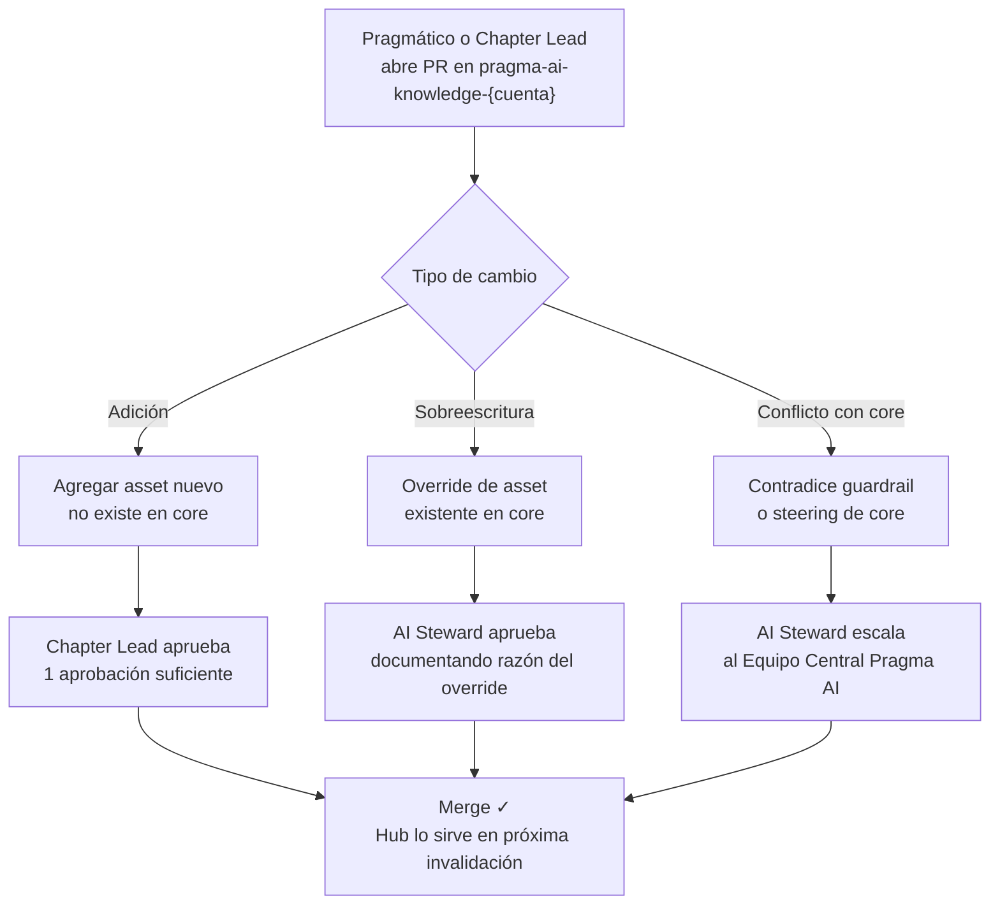

### 9.3 Notificación de cambios en core

Cuando `pragma-ai-knowledge-core` actualiza un asset que tiene overrides activos en repos de cuenta, un GitHub Action notifica automáticamente al AI Steward de cada cuenta afectada:

> **Asunto:** [SOPP AI] Se actualizó `chapters/backend/skills/java-spring/generate-pr-description.md` en core  
> Tu cuenta tiene un override activo de este asset. ¿Adoptas el cambio de core o mantienes el override?

El AI Steward decide. Si no hay acción en 14 días el Hub mantiene el override sin cambios. Nunca autopisa contenido de cuenta.

---

## 10. Decisiones de Diseño Abiertas

| # | Decisión | Opciones | Impacto |
|---|---|---|---|
| 1 | **Convención de nombres de repos** | `pragma-ai-knowledge-core` / `pragma-ai-knowledge-{cuenta}` / `sopp-ai-hub` u otra convención | Legibilidad y organización en GitHub |
| 2 | **Org de GitHub para repos de cuenta** | Repo en org de Pragma vs repo en org de la cuenta | Visibilidad, permisos y gobierno |
| 3 | **Intervalo del scheduler** | 4h vs 8h vs on-demand | Balance entre frescura y uso de recursos |
| 4 | **Pragmático en múltiples cuentas** | Perfil multi-cuenta vs workspace por cuenta | Complejidad del CLI |
| 5 | **Rollback de contenido** | Versionado semántico + tag en Git vs versiones en S3 | Recuperación ante errores de contenido |
| 6 | **Límite de contexto por herramienta** | Copilot tiene límites más estrictos que Cursor | Estrategia de truncado o priorización de assets |
| 7 | **Schema completo por tipo de asset** | A definir por el Equipo Central | Consistencia del repo de contenido |
---

## 11. Infraestructura AWS

### 11.1 Visión general


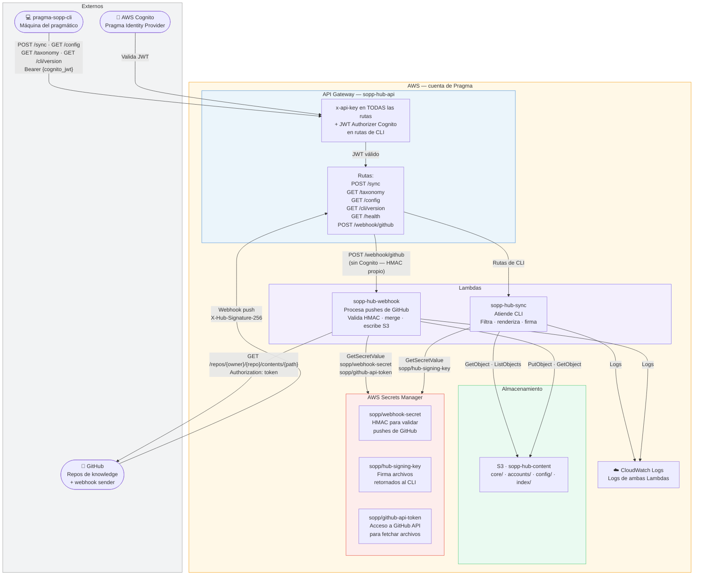

---

### 11.2 API Gateway — rutas y autenticación

Todas las rutas requieren `x-api-key`. Las rutas de CLI requieren además Cognito JWT.

| Ruta | Método | x-api-key | Cognito JWT | Lambda |
|---|---|---|---|---|
| `/sync` | POST | ✅ | ✅ | sopp-hub-sync |
| `/taxonomy` | GET | ✅ | ✅ | sopp-hub-sync |
| `/config` | GET | ✅ | ✅ | sopp-hub-sync |
| `/health` | GET | ✅ | ❌ | sopp-hub-sync |
| `/webhook/github` | POST | ✅ | ❌ | sopp-hub-webhook |

`/health` y `/webhook/github` no usan Cognito pero sí requieren la API Key. El webhook además tiene validación HMAC interna en la Lambda. La API Key está embebida en el binario del CLI — no se descarga del Hub.

---

### 11.3 IAM — permisos por Lambda

**sopp-hub-sync:**

```json
{
  "Statement": [
    {
      "Effect": "Allow",
      "Action": ["s3:GetObject", "s3:ListBucket"],
      "Resource": [
        "arn:aws:s3:::sopp-hub-content",
        "arn:aws:s3:::sopp-hub-content/*"
      ]
    },
    {
      "Effect": "Allow",
      "Action": "secretsmanager:GetSecretValue",
      "Resource": "arn:aws:secretsmanager:{region}:{account}:secret:sopp/hub-signing-key-*"
    },
    {
      "Effect": "Allow",
      "Action": ["logs:CreateLogGroup", "logs:CreateLogStream", "logs:PutLogEvents"],
      "Resource": "arn:aws:logs:*:*:*"
    }
  ]
}
```

**sopp-hub-webhook:**

```json
{
  "Statement": [
    {
      "Effect": "Allow",
      "Action": ["s3:GetObject", "s3:PutObject", "s3:ListBucket"],
      "Resource": [
        "arn:aws:s3:::sopp-hub-content",
        "arn:aws:s3:::sopp-hub-content/*"
      ]
    },
    {
      "Effect": "Allow",
      "Action": "secretsmanager:GetSecretValue",
      "Resource": [
        "arn:aws:secretsmanager:{region}:{account}:secret:sopp/webhook-secret-*",
        "arn:aws:secretsmanager:{region}:{account}:secret:sopp/github-api-token-*"
      ]
    },
    {
      "Effect": "Allow",
      "Action": ["logs:CreateLogGroup", "logs:CreateLogStream", "logs:PutLogEvents"],
      "Resource": "arn:aws:logs:*:*:*"
    }
  ]
}
```

---

### 11.4 Flujo completo por caso de uso

**Caso 1 — CLI hace sync:**
```
CLI → API Gateway (valida JWT con Cognito)
    → sopp-hub-sync
    → Secrets Manager (sopp/hub-signing-key)
    → S3 (lee config/, index/ids.json, core/, accounts/)
    → Firma archivos → responde al CLI
```

**Caso 2 — Chapter Lead hace push a main:**
```
GitHub → API Gateway (ruta /webhook/github, sin JWT Authorizer)
       → sopp-hub-webhook
       → Secrets Manager (sopp/webhook-secret → valida HMAC)
       → Secrets Manager (sopp/github-api-token → fetcha archivos de GitHub API)
       → GitHub API (contenido de archivos modificados)
       → S3 (escribe merge, actualiza ids.json y version.json)
```

**Caso 3 — CLI hace install (primera vez):**
```
CLI → API Gateway (valida JWT con Cognito)
    → sopp-hub-sync (GET /config)
    → Secrets Manager (sopp/hub-signing-key)
    → S3 (lee config/ides.json)
    → Responde con { ides, signing_key }
    → CLI guarda signing_key en ~/.pragma-sopp/auth.json
```