# SOPP Hub — Diseño de las Lambdas

## Dos Lambdas con responsabilidades completamente separadas

| Lambda | Trigger | Responsabilidad |
|---|---|---|
| `sopp-hub-webhook` | Push en GitHub | Resuelve el merge core+cuenta y escribe en S3 |
| `sopp-hub-sync` | Request del CLI | Lee S3, filtra, renderiza por tool, firma y responde |

Ninguna sabe lo que hace la otra. El contrato entre ellas es S3.

---

## Secretos del sistema

Hay dos secretos completamente distintos. Confundirlos es un error de seguridad.

### `SOPP_WEBHOOK_SECRET` — GitHub → Hub

GitHub lo usa para firmar el payload de cada webhook que envía al Hub. El Hub verifica esa firma para saber que el push viene realmente de GitHub y no de alguien suplantando el webhook.

**Un solo secret para todos los repos.** Vive en AWS Secrets Manager y la Lambda webhook lo lee al arrancar. Cuando se configura el webhook en cada repo de GitHub, se usa este mismo valor.

**Flujo:**
```
GitHub genera HMAC-SHA256 del payload con SOPP_WEBHOOK_SECRET
  → lo incluye en el header X-Hub-Signature-256
  → Hub recibe el webhook
  → Hub lee SOPP_WEBHOOK_SECRET desde AWS Secrets Manager (cacheado en memoria)
  → Hub recalcula HMAC-SHA256 del payload
  → si coinciden → webhook legítimo → procesa
  → si no coinciden → 401 → descarta
```

**Dónde vive:**
- En AWS Secrets Manager: `sopp/webhook-secret`
- En GitHub: como webhook secret al configurar el webhook en cada repo — mismo valor para todos

**Cómo se genera y configura:**
```bash
# 1. Generar el secret una sola vez
SECRET=$(openssl rand -hex 32)

# 2. Guardarlo en AWS Secrets Manager
aws secretsmanager create-secret \
  --name sopp/webhook-secret \
  --secret-string "$SECRET"

# 3. Usarlo al configurar el webhook en cada repo de GitHub
#    Settings → Webhooks → Add webhook → Secret: $SECRET
#    (mismo valor para pragma-ai-knowledge-core y todos los pragma-ai-knowledge-{cuenta})
```

---

### `SOPP_HUB_SIGNING_KEY` — Hub → CLI

El Hub lo usa para firmar cada archivo que retorna al CLI en el response del sync. El CLI verifica esa firma antes de escribir cualquier archivo en disco.

**Dónde vive:**
- En AWS Secrets Manager: `sopp/hub-signing-key`
- En el CLI: lo recibe al hacer `pragma-sopp-cli install` a través del response de `GET /config`, y lo guarda en `~/.pragma-sopp/auth.json`

**Cómo llega al CLI:**
```
pragma-sopp-cli install
  → GET /config (con JWT de Cognito)
  → response incluye { ides: [...], signing_key: "..." }
  → CLI guarda signing_key en ~/.pragma-sopp/auth.json
  → En cada sync: CLI verifica firma de cada archivo recibido con esa key
```

---

### `SOPP_GITHUB_API_TOKEN` — Hub → GitHub API

La Lambda webhook necesita fetchar el contenido de los archivos modificados desde GitHub API cuando procesa un push. Este token es un GitHub App token o Personal Access Token con permisos de lectura sobre los repos de knowledge.

**Dónde vive:**
- En AWS Secrets Manager: `sopp/github-api-token`
- La Lambda webhook lo lee en cold start y lo cachea en memoria igual que los otros secrets

**Permisos requeridos en GitHub:**
- `contents:read` sobre `pragma-ai-knowledge-core`
- `contents:read` sobre todos los `pragma-ai-knowledge-{cuenta}`

**Flujo:**
```
Lambda webhook arranca (cold start)
  → Lee sopp/github-api-token desde Secrets Manager → memoria
  → En cada push: usa el token para GET /repos/{owner}/{repo}/contents/{path}
  → GitHub retorna el contenido del archivo modificado
  → Lambda procesa y escribe en S3
```

---

### Resumen de los tres secrets en Secrets Manager

| Secret | Path en Secrets Manager | Quién lo usa | Para qué |
|---|---|---|---|
| `SOPP_WEBHOOK_SECRET` | `sopp/webhook-secret` | Lambda webhook | Validar que el push viene de GitHub |
| `SOPP_HUB_SIGNING_KEY` | `sopp/hub-signing-key` | Lambda sync | Firmar archivos enviados al CLI |
| `SOPP_GITHUB_API_TOKEN` | `sopp/github-api-token` | Lambda webhook | Fetchar contenido de repos de GitHub |

---

## Estructura de S3

```
s3://sopp-hub-content/
  config/                               ← archivos de _config/ del core (copiados tal cual)
    taxonomy.json                       ← servido en GET /taxonomy
    ides.json                           ← servido en GET /config
    templates/
      cursor/
      kiro/
      github-copilot/
      amazon-q-ide/
      amazon-q-cli/

  index/
    ids.json                            ← índice global de todos los IDs conocidos

  core/
    shared/
      steering/
        pragma-global.md                ← aplica a TODOS
      guardrails/
        pragma-guardrails.md
    chapters/
      backend/
        steering/
          pragma-backend.md             ← aplica a todo backend
        skills/
          java-spring/
            webflux-error-handling.md
            generate-pr-description.md
          node-express/
          node-lambda/
          java-webflux/
          dotnet/
        workflows/
        guardrails/
        personas/
      calidad/
      mobile/
        flutter/
        android-native/
        apple-native/
      frontend/
        react/
        angular/
      arquitectura/

  accounts/
    bancolombia/
      version.json                      ← metadata de versiones y hashes, sin contenido
      chapters/
        backend/
          skills/
            java-spring/
              webflux-error-handling.md ← override o merge resuelto vs core
              nueva-skill-bancolombia.md
```

### El `ids.json` — índice global

```json
{
  "webflux-error-handling": {
    "core": "core/chapters/backend/skills/java-spring/webflux-error-handling.md",
    "accounts": {
      "bancolombia": "accounts/bancolombia/chapters/backend/skills/java-spring/webflux-error-handling.md"
    }
  },
  "generate-pr-description": {
    "core": "core/chapters/backend/skills/java-spring/generate-pr-description.md",
    "accounts": {}
  },
  "pragma-global-steering": {
    "core": "core/shared/steering/pragma-global.md",
    "accounts": {}
  },
  "nueva-skill-bancolombia": {
    "core": null,
    "accounts": {
      "bancolombia": "accounts/bancolombia/chapters/backend/skills/java-spring/nueva-skill-bancolombia.md"
    }
  }
}
```

### El `version.json` por cuenta — solo metadata, sin contenido

```json
{
  "version": "2.4.0",
  "updated_at": "2026-04-29T10:00:00Z",
  "files": {
    "core/chapters/backend/skills/java-spring/webflux-error-handling.md": {
      "version": "1.3.0",
      "hash": "sha256:e3b0c44298fc...",
      "source": "merge"
    },
    "core/chapters/backend/skills/java-spring/generate-pr-description.md": {
      "version": "1.1.0",
      "hash": "sha256:f4e3d2c1b0a9...",
      "source": "core"
    },
    "accounts/bancolombia/chapters/backend/skills/java-spring/nueva-skill-bancolombia.md": {
      "version": "1.0.0",
      "hash": "sha256:a1b2c3d4e5f6...",
      "source": "cuenta"
    }
  }
}
```

---

## Lambda Webhook — `sopp-hub-webhook`

### Trigger

GitHub envía un webhook en cada push a `pragma-ai-knowledge-core` o a cualquier `pragma-ai-knowledge-{cuenta}`. La Lambda recibe exactamente qué archivos cambiaron.

---

### Operación 1 — Verificar firma del webhook

La Lambda no necesita un Accounts Registry. La seguridad viene de dos capas que ya están garantizadas antes de que la Lambda despierte:

- **`x-api-key`** — API Gateway lo valida. Si la key es inválida, la Lambda nunca se invoca.
- **`X-Hub-Signature-256`** — La Lambda verifica que el HMAC del payload coincide con el `SOPP_WEBHOOK_SECRET`. Si no coincide, rechaza.

Con ambas capas válidas, el repo es legítimo. La Lambda extrae el `{cuenta}` directamente del nombre del repo usando el patrón `pragma-ai-knowledge-{cuenta}`. Si el repo es `pragma-ai-knowledge-core`, la cuenta es `core`. No hay lista de repos permitidos — el patrón de nombre más las dos validaciones es suficiente.

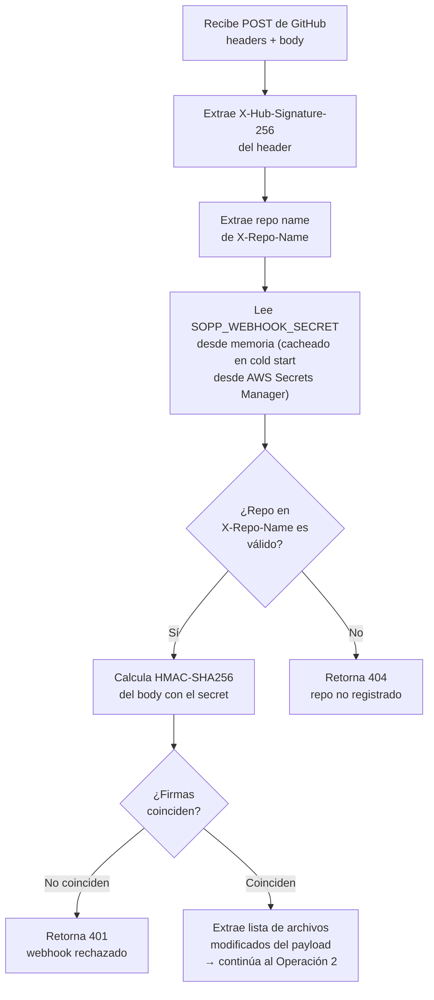

---

### Operación 2 — Clasificar cada archivo modificado

Por cada archivo en el payload, decide qué operación ejecutar.

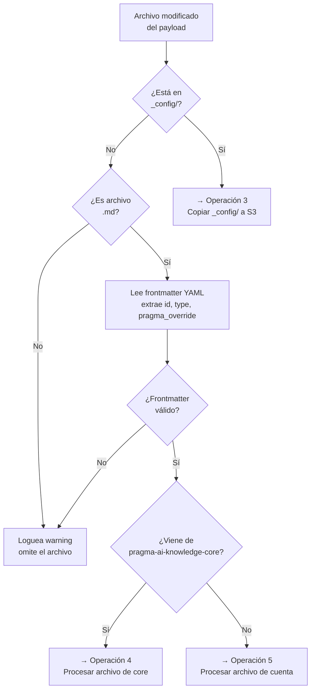

---

### Operación 3 — Copiar archivo `_config/` a S3

Sin lógica de merge ni IDs. Copia directa.

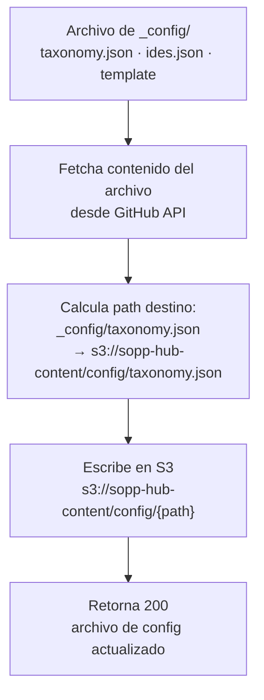

---

### Operación 4 — Procesar archivo de core

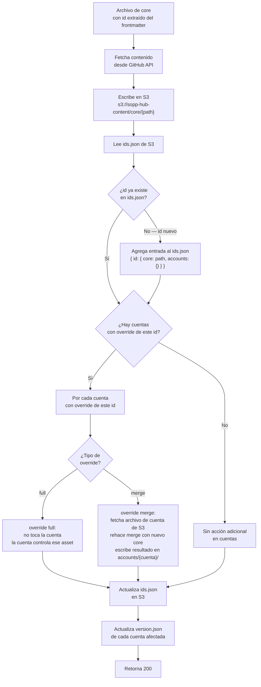

---

### Operación 5 — Procesar archivo de cuenta

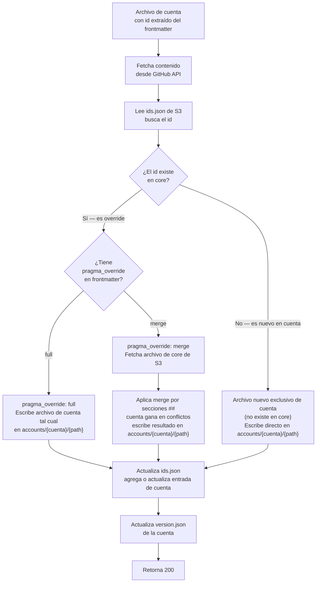

---

### Merge por secciones markdown (Operación 5 — override merge)

Reglas:
- Sección existe en core y en cuenta → gana cuenta
- Sección existe solo en core → se mantiene
- Sección existe solo en cuenta → se agrega al final
- El core nunca pisa lo que la cuenta declaró explícitamente

**Regla de fallback — `pragma_extends` apunta a un id que no existe en core:**

Si el archivo de cuenta declara `pragma_extends` con un id que no está en `ids.json` o que no tiene path en `core`, la Lambda ignora el `pragma_extends` y el `pragma_override` y trata el archivo como un asset nuevo exclusivo de cuenta. Lo escribe tal cual en `accounts/{cuenta}/` y lo registra en `ids.json` sin path en core. Sin error, sin bloqueo — el comportamiento es idéntico al de cualquier archivo nuevo de cuenta.

**Ejemplo — core:**
```markdown
---
id: webflux-error-handling
version: 1.2.0
scope: stack
chapter: backend
stack: [java-spring]
---

## Instrucción base
Maneja errores en WebFlux usando onErrorResume y onErrorReturn.

## Tono
Técnico, conciso. Español.

## Ejemplo
Muestra siempre un ejemplo con Mono y otro con Flux.
```

**Ejemplo — cuenta (solo declara lo que cambia):**
```markdown
---
id: webflux-error-handling
version: 1.0.0
pragma_extends: core/chapters/backend/skills/java-spring/webflux-error-handling
pragma_override: merge
---

## Tono
Técnico, conciso. En inglés — Bancolombia exige PRs en inglés.

## Estándares de Bancolombia
Siempre referencia el código de error del catálogo interno.
Formato: BC-{código}
```

**Resultado en S3:**
```markdown
---
id: webflux-error-handling
version: core:1.2.0+cuenta:1.0.0
source: merge
---

## Instrucción base
Maneja errores en WebFlux usando onErrorResume y onErrorReturn.

## Tono
Técnico, conciso. En inglés — Bancolombia exige PRs en inglés.

## Ejemplo
Muestra siempre un ejemplo con Mono y otro con Flux.

## Estándares de Bancolombia
Siempre referencia el código de error del catálogo interno.
Formato: BC-{código}
```

---

## Lambda Sync — `sopp-hub-sync`

### Trigger

Request `POST /sync` del CLI con el JWT de Cognito, la herramienta activa, los stacks del workspace y la versión local.

---

### Operación 1 — Cold start: cargar config en memoria

Solo ocurre cuando Lambda arranca un container nuevo. Las invocaciones siguientes usan la memoria del container.

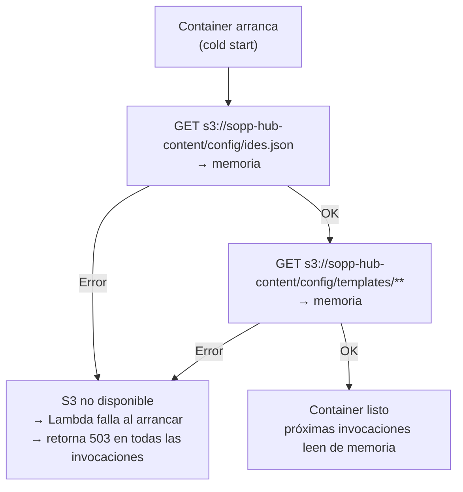

Cuando el Equipo de Plataforma actualiza `ides.json`, los containers existentes siguen con la versión anterior hasta que Lambda los recicle. No hay invalidación activa — `ides.json` cambia raramente y el impacto es mínimo.

---

### Operación 2 — Validar JWT y resolver perfil

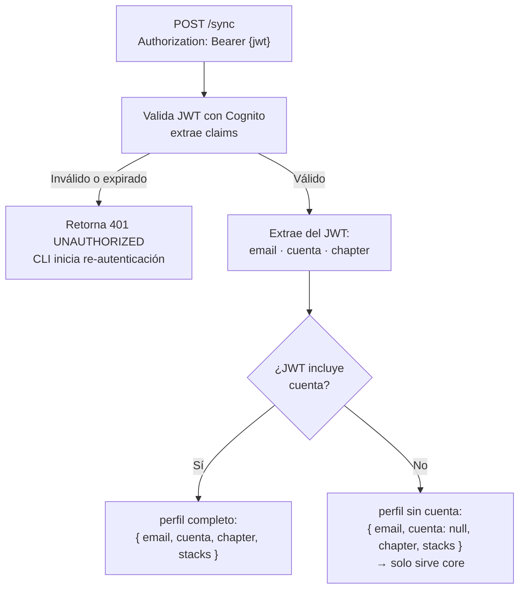

---

### Operación 3 — Construir la unión de assets

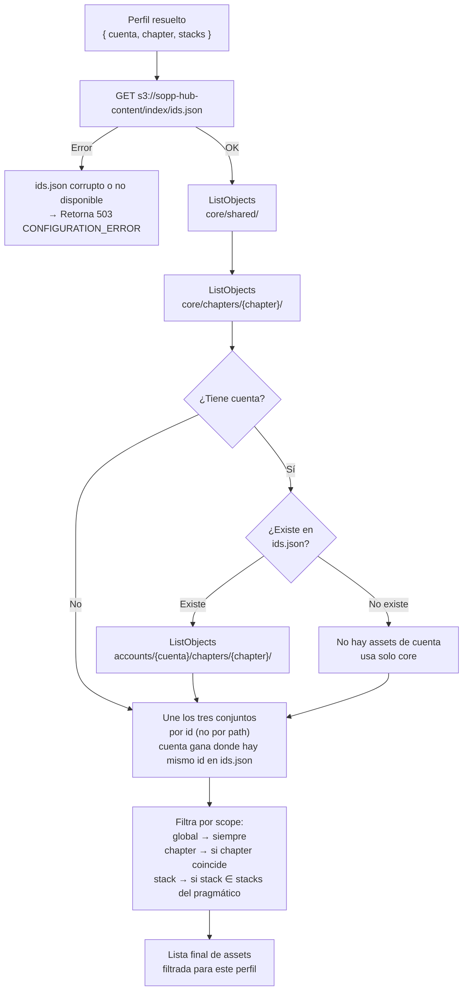

---

### Operación 4 — Calcular diff

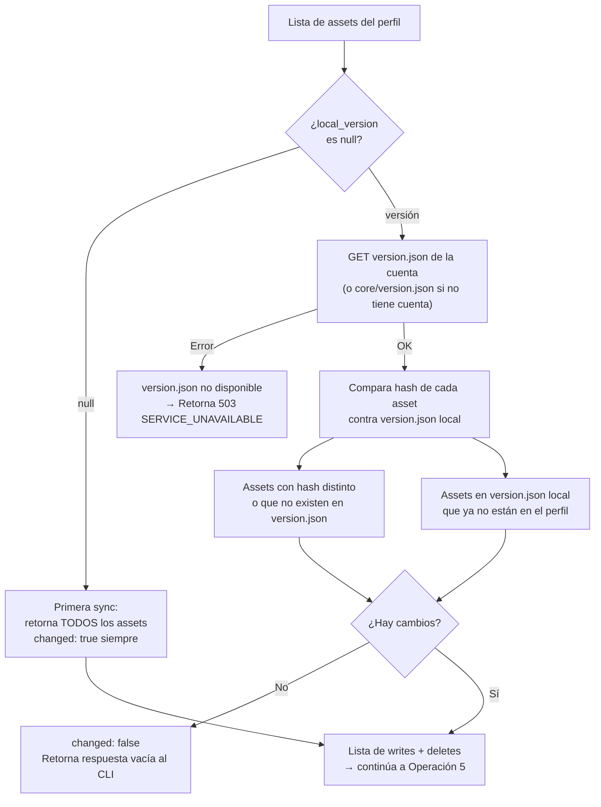

---

### Operación 5 — Renderizar y firmar

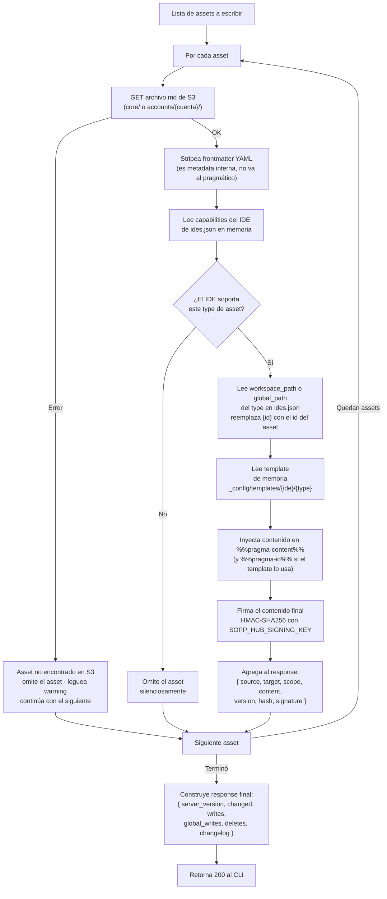

---

### Error handling consolidado

| Situación | Lambda | Código | Qué ve el CLI |
|---|---|---|---|
| API Key inválida o ausente | API Gateway | `403 FORBIDDEN` | Error inmediato — API Key comprometida, actualizar CLI |
| Firma GitHub inválida | Webhook | `401 UNAUTHORIZED` | — (no llega al CLI) |
| Repo no registrado | Webhook | `404 NOT_FOUND` | — (no llega al CLI) |
| S3 no disponible | Ambas | `503 SERVICE_UNAVAILABLE` | Sistema no disponible — contactar al administrador |
| `ids.json` corrupto | Ambas | `503 CONFIGURATION_ERROR` | Sistema no disponible — contactar al administrador |
| `ides.json` corrupto | Sync | `503 CONFIGURATION_ERROR` | Sistema no disponible — contactar al administrador |
| `taxonomy.json` corrupto | Sync | `503 CONFIGURATION_ERROR` | Sistema no disponible — contactar al administrador |
| JWT inválido o expirado | Sync | `401 UNAUTHORIZED` | CLI inicia re-autenticación automática |
| Cuenta no registrada | Sync | `200` sin error | Sync normal — solo contenido transversal de core |
| Asset faltante en S3 | Sync | `200` con warning | Asset omitido del sync, resto normal |

---

## Costos estimados (producción real)

| Componente | Uso estimado | Costo mensual |
|---|---|---|
| Lambda webhook | ~50 pushes/día × 2 repos | < $0.01 |
| Lambda sync | ~500 syncs/día (scheduler 4h × pragmáticos) | < $1 |
| S3 almacenamiento | ~50MB de archivos markdown | < $0.01 |
| S3 lecturas | ~10 reads por sync × 500/día | < $1 |
| API Gateway | ~15.000 requests/mes | ~$0.05 |
| **Total** | | **< $3/mes** |
---

## Arquitectura del Proyecto — `sopp-pragma-ai-hub`

### Stack tecnológico

| Decisión | Valor |
|---|---|
| Runtime | Node.js 22 |
| Lenguaje | TypeScript |
| Arquitectura | Hexagonal / Clean Architecture |
| Build | esbuild (bundle por Lambda → un solo archivo JS) |
| Output | ZIP por Lambda → S3 de deployments → Lambda update |
| Deploy | Azure DevOps pipeline |

---

### Estructura de carpetas del repositorio

```
sopp-pragma-ai-hub/
├── lambdas/
│   ├── sync/                          ← Lambda sopp-hub-sync
│   │   ├── src/
│   │   │   ├── domain/
│   │   │   │   ├── models/            ← entidades del dominio
│   │   │   │   │   ├── Asset.ts
│   │   │   │   │   ├── Profile.ts
│   │   │   │   │   └── SyncResult.ts
│   │   │   │   ├── ports/             ← interfaces (contratos) del dominio
│   │   │   │   │   ├── driven/
│   │   │   │   │   │   ├── IAssetRepository.ts
│   │   │   │   │   │   ├── IConfigRepository.ts
│   │   │   │   │   │   └── ISecretsRepository.ts
│   │   │   │   │   └── driving/
│   │   │   │   │       └── ISyncUseCase.ts
│   │   │   │   └── usecases/          ← casos de uso (lógica de negocio pura)
│   │   │   │       ├── BuildAssetUnion.ts
│   │   │   │       ├── FilterAssetsByProfile.ts
│   │   │   │       ├── RenderAssets.ts
│   │   │   │       └── SignAssets.ts
│   │   │   ├── application/
│   │   │   │   └── config/
│   │   │   │       ├── container.ts   ← inyección de dependencias (DI manual o tsyringe)
│   │   │   │       └── bootstrap.ts   ← inicialización del container en cold start
│   │   │   └── infrastructure/
│   │   │       ├── entry-points/
│   │   │       │   └── api-gateway/
│   │   │       │       └── handler.ts ← punto de entrada de la Lambda (exports.handler)
│   │   │       └── driven-adapters/
│   │   │           ├── s3/
│   │   │           │   └── S3AssetRepository.ts
│   │   │           ├── secrets-manager/
│   │   │           │   └── SecretsManagerRepository.ts
│   │   │           └── config/
│   │   │               └── S3ConfigRepository.ts
│   │   ├── package.json
│   │   ├── tsconfig.json
│   │   └── esbuild.config.ts
│   │
│   └── webhook/                       ← Lambda sopp-hub-webhook
│       ├── src/
│       │   ├── domain/
│       │   │   ├── models/
│       │   │   │   ├── WebhookPayload.ts
│       │   │   │   ├── AssetFile.ts
│       │   │   │   └── MergeResult.ts
│       │   │   ├── ports/
│       │   │   │   ├── driven/
│       │   │   │   │   ├── IAssetStore.ts
│       │   │   │   │   ├── IGithubClient.ts
│       │   │   │   │   ├── IIndexRepository.ts
│       │   │   │   │   └── ISecretsRepository.ts
│       │   │   │   └── driving/
│       │   │   │       └── IWebhookUseCase.ts
│       │   │   └── usecases/
│       │   │       ├── ValidateWebhookSignature.ts
│       │   │       ├── ClassifyFiles.ts
│       │   │       ├── ProcessCoreFile.ts
│       │   │       ├── ProcessAccountFile.ts
│       │   │       ├── MergeBySection.ts
│       │   │       └── UpdateIndex.ts
│       │   ├── application/
│       │   │   └── config/
│       │   │       ├── container.ts
│       │   │       └── bootstrap.ts
│       │   └── infrastructure/
│       │       ├── entry-points/
│       │       │   └── api-gateway/
│       │       │       └── handler.ts
│       │       └── driven-adapters/
│       │           ├── s3/
│       │           │   ├── S3AssetStore.ts
│       │           │   └── S3IndexRepository.ts
│       │           ├── secrets-manager/
│       │           │   └── SecretsManagerRepository.ts
│       │           └── github-api/
│       │               └── GithubApiClient.ts
│       ├── package.json
│       ├── tsconfig.json
│       └── esbuild.config.ts
│
├── deployment/
│   ├── build.sh                       ← compila solo la Lambda que cambió
│   ├── deploy.sh                      ← sube ZIP a S3 y actualiza la Lambda
│   └── azure-pipeline.yml             ← pipeline de Azure DevOps
│
├── package.json                       ← workspace root (npm workspaces)
└── tsconfig.base.json                 ← config TypeScript compartida
```

---

### Principios de la arquitectura hexagonal aplicados

**Domain — el núcleo, sin dependencias externas**

Los modelos, puertos y casos de uso no importan nada de AWS, S3, GitHub ni ninguna librería externa. Son TypeScript puro. Esto los hace completamente testeables sin mocks de infraestructura.

```
domain/models/     → clases/interfaces que representan el negocio
domain/ports/      → interfaces que el dominio necesita (driven) y ofrece (driving)
domain/usecases/   → lógica de negocio que orquesta modelos y llama puertos
```

**Application — wiring**

Solo conecta el dominio con la infraestructura. El `container.ts` instancia los adaptadores reales y los inyecta en los casos de uso. El `bootstrap.ts` se llama una sola vez en el cold start de la Lambda — no en cada invocación.

```typescript
// lambdas/sync/src/application/config/bootstrap.ts
import { container } from './container'

let initialized = false

export function bootstrap() {
  if (initialized) return          // cold start guard — se ejecuta una vez
  container.register(...)
  initialized = true
}
```

**Infrastructure — adaptadores**

Cada adaptador implementa un puerto del dominio. El dominio nunca sabe que existe S3 o GitHub API — solo conoce la interfaz `IAssetRepository`.

```
entry-points/     → adaptadores de ENTRADA — reciben el trigger (API Gateway)
driven-adapters/  → adaptadores de SALIDA — llaman a servicios externos (S3, SM, GitHub)
```

**Regla de dependencias:** las flechas solo apuntan hacia adentro.

```
infrastructure → application → domain
                               ↑
                   (nunca al revés)
```

---

### Build y deploy — flujo completo

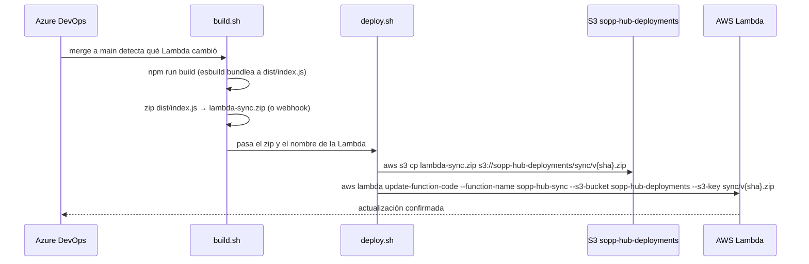

**El pipeline solo deploya la Lambda que cambió.** Azure DevOps compara los paths modificados en el PR:

```yaml
# deployment/azure-pipeline.yml
trigger:
  branches:
    include: [main]

stages:
  - stage: Build
    jobs:
      - job: DetectChanges
        steps:
          - script: |
              CHANGED=$(git diff --name-only HEAD~1 HEAD)
              echo "##vso[task.setvariable variable=syncChanged]$(echo $CHANGED | grep -c 'lambdas/sync')"
              echo "##vso[task.setvariable variable=webhookChanged]$(echo $CHANGED | grep -c 'lambdas/webhook')"

      - job: BuildSync
        condition: eq(variables.syncChanged, '1')
        steps:
          - script: cd lambdas/sync && npm ci && npm run build
          - script: bash deployment/build.sh sync
          - script: bash deployment/deploy.sh sync $(Build.SourceVersion)
        env:
          AWS_ACCESS_KEY_ID: $(AWS_ACCESS_KEY_ID)
          AWS_SECRET_ACCESS_KEY: $(AWS_SECRET_ACCESS_KEY)
          AWS_REGION: us-east-1

      - job: BuildWebhook
        condition: eq(variables.webhookChanged, '1')
        steps:
          - script: cd lambdas/webhook && npm ci && npm run build
          - script: bash deployment/build.sh webhook
          - script: bash deployment/deploy.sh webhook $(Build.SourceVersion)
        env:
          AWS_ACCESS_KEY_ID: $(AWS_ACCESS_KEY_ID)
          AWS_SECRET_ACCESS_KEY: $(AWS_SECRET_ACCESS_KEY)
          AWS_REGION: us-east-1
```

**`deployment/build.sh`:**

```bash
#!/bin/bash
LAMBDA=$1  # "sync" o "webhook"

cd lambdas/$LAMBDA
npm run build                          # esbuild → dist/index.js
cd dist
zip -r ../lambda-$LAMBDA.zip index.js
echo "✓ lambda-$LAMBDA.zip generado"
```

**`deployment/deploy.sh`:**

```bash
#!/bin/bash
LAMBDA=$1   # "sync" o "webhook"
SHA=$2      # git commit SHA

FUNCTION_NAME="sopp-hub-$LAMBDA"
S3_KEY="$LAMBDA/v$SHA.zip"

aws s3 cp lambdas/$LAMBDA/lambda-$LAMBDA.zip s3://sopp-hub-deployments/$S3_KEY
aws lambda update-function-code \
  --function-name $FUNCTION_NAME \
  --s3-bucket sopp-hub-deployments \
  --s3-key $S3_KEY
echo "✓ $FUNCTION_NAME actualizada desde s3://sopp-hub-deployments/$S3_KEY"
```

---

### esbuild config por Lambda

```typescript
// lambdas/sync/esbuild.config.ts
import { build } from 'esbuild'

build({
  entryPoints: ['src/infrastructure/entry-points/api-gateway/handler.ts'],
  bundle: true,
  platform: 'node',
  target: 'node22',
  outfile: 'dist/index.js',
  external: ['@aws-sdk/*'],   // AWS SDK ya está en el runtime de Lambda — no bundlear
  minify: true,
  sourcemap: false,
})
```

`@aws-sdk/*` va en `external` porque Node.js 22 en Lambda ya incluye el SDK. Bundlearlo inflaría el ZIP innecesariamente.

---

### tsconfig por Lambda

```json
// lambdas/sync/tsconfig.json
{
  "extends": "../../tsconfig.base.json",
  "compilerOptions": {
    "outDir": "dist",
    "rootDir": "src"
  },
  "include": ["src/**/*"]
}
```

```json
// tsconfig.base.json
{
  "compilerOptions": {
    "target": "ES2022",
    "module": "CommonJS",
    "strict": true,
    "esModuleInterop": true,
    "skipLibCheck": true,
    "resolveJsonModule": true,
    "declaration": true,
    "declarationMap": true
  }
}
```